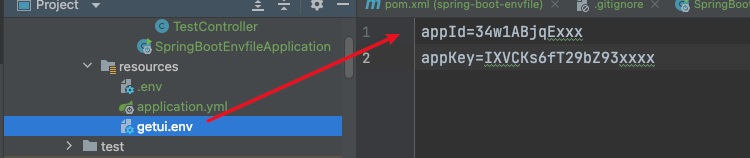
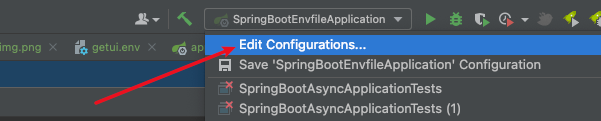
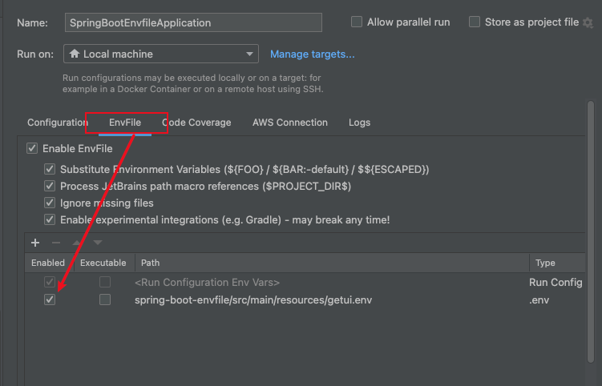
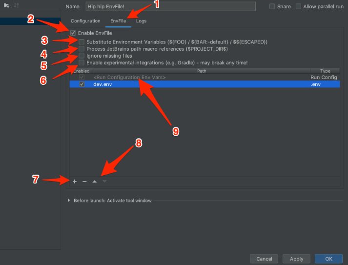
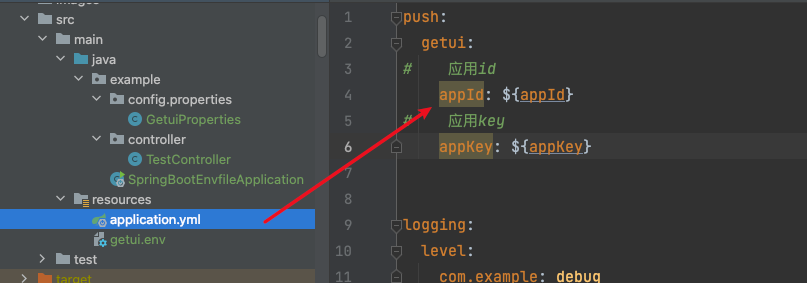
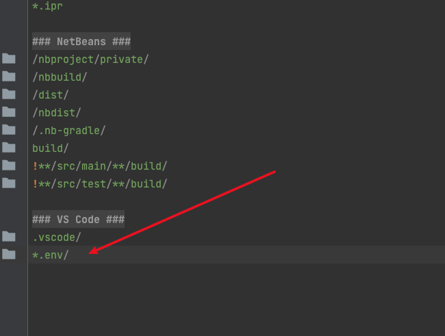

### envfile

####  envfile介绍

env可以有效防止配置信息,在公网泄露

第一步：按照evnfile插件

第二步：创建getui.env文件

第三步：环境配置

第四步：创建application.yml配置文件

第五步：创建配置文件映射

~~~java
@Data
@ConfigurationProperties(prefix = "push.getui")
@Component
public class GetuiProperties {
    /**
     * 应用id
     */
    private String appId;
    /**
     * 应用key
     */
    private String appKey;
}

~~~

第六步：创建启动类

~~~java

@RestController
@RequestMapping("/")
@Slf4j
public class TestController {
    @Autowired
    private GetuiProperties getuiProperties;

    @GetMapping("/getInfo")
    public void getInfo(){
        log.error(JSON.toJSONString(getuiProperties,true));
    }
}

~~~

第七步 忽略.env文件

